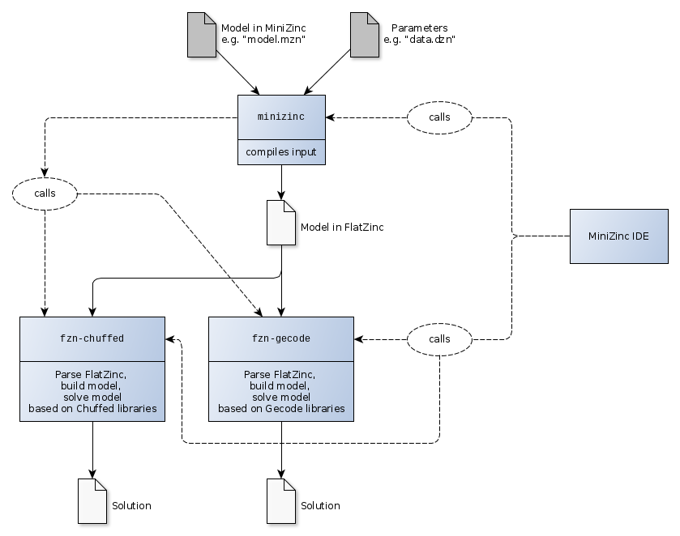

# Building the MiniZinc libraries and tools + associated solvers

This directory contains some notes on how to build, on Linux:

- The "Gecode" solver libraries and tools: [Building Gecode](building_gecode.md)
- The "Chuffed" solver libraries and tools: [Building Chuffed](building_chuffed.md)
- The "libminizinc" libraries and tools: [Building libminizinc](building_libminizinc.md)

You want to first build Gecode and Chuffed. In particular, "libminizinc" needs files provided by Gecode.

Here is an image depicting how these elements fits together (reality may differ slightly, always open to fixes):

- The user provides a model file `model.mzn` and possible a configuration/parameter file `data.dzn`.
  These are written in the _MiniZinc_ language (a restricted/manageable form of the full _Zinc_ language).
- The `minizinc` tool provided by "libminizinc" (the latter a package of tools and libraries) compiles
  the MiniZinc model into an intermediary model expressined in the _FlatZinc_ language. _FlatZinc_ is
  simpler so that constraint propagation solvers (or even SAT solvers) can be given a preprocessing element that
  is able to transform _FlatZinc_ models into their respective internal models (possibly 
  expressed as language-dependent datastructures). The intermediate model may contain solver-specific
  annotations.
- The model file in _FlatZinc_ is given to one of several solvers able to read _FlatZinc_ code.
  (It may be that the intermediary model it is not even serialized out into a file, but passed directly
  as an Abstract Syntax Tree). In this case we can use the solvers (which are actually libraries and tools)
  Chuffed and Gecode.
  - Chuffed provides the tool `fzn-chuffed` to read a FlatZinc file, build a model using the 
    Chuffed classes, and solve it.
  - Gecode provides the tool `fzn-gecode` to read a FlatZinc file, build a model using the 
    Gecode classes, and solve it.
- The pipeline is managed either by the `minizinc` tool, or from the command line, or a 
  script, or through the "MiniZinc IDE".

    

