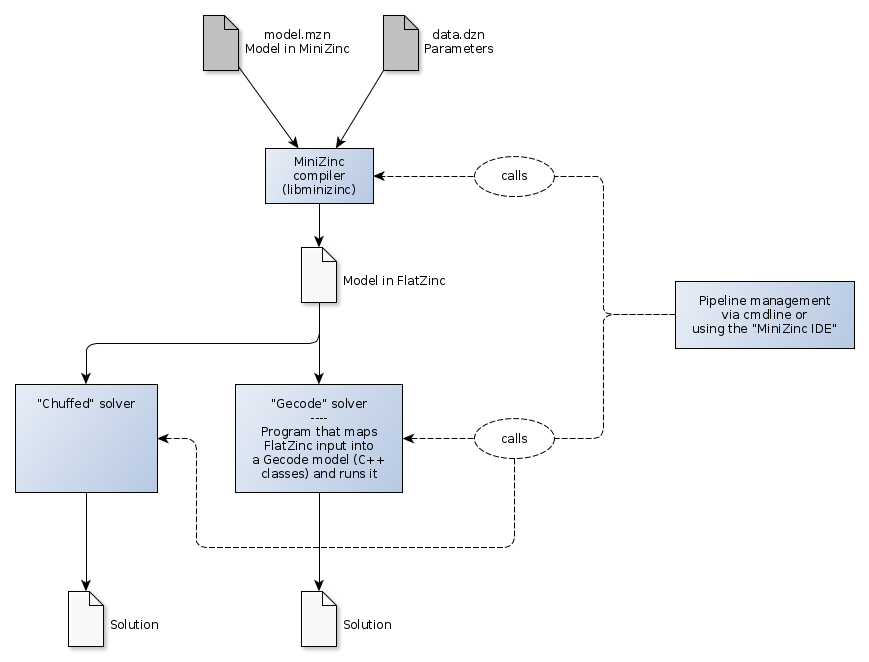

# Building the "Gecode" solver libraries and tools

## About "Gecode"

**"Gecode"** is the "generic constraint development environment".

> Gecode is an open source C++ toolkit for developing constraint-based systems and applications.  
> Gecode provides a constraint solver with state-of-the-art performance while being modular and extensible.

So Gecode provides C++ classes to model and solve constraint optimization problems in C++. This is of course
less convenient for doing "exploratory optimization" than having a dedicated high-level language.

Gecode can process the [FlatZinc language files](https://www.gecode.org/flatzinc.html) generated by the MiniZinc compiler.

> We provide a parser that reads a FlatZinc model from a file, and returns a Gecode Space object that represents
> the model. We also provide a simple front-end, an executable program that reads a FlatZinc model and prints
> the solution (if any) on the standard output.    

The invocation to make the MiniZinc compiler generate FlatZinc output without
passing it to Gecode or another solver is apparently `minizinc -c --solver org.minizinc.mzn-fzn`.

See ["Chapter 2.8: FlatZinc and Flattening"](https://www.minizinc.org/doc-2.5.5/en/flattening.html) 
in the "MiniZinc Handbook" for more on this.



The **"Gist"** tool (no relation to a github "gist") is the "Gecode interactive search tool".
This might be the tool that gets invoked when you select "Profile search" in the MiniZinc IDE.

From the Gecode manual, chapter 2.4:

> When developing a constraint model, the usual outcome of a first modeling attempt is that
> the model has no solutions or searching for a solution takes too much time to be feasible.
> What one really needs in these situations is additional insight as to: why does the model
> have no solutions, why is propagation not sufficient, or why is the branching not appropriate
> for the problem?
>
> Gecode offers Gist as a graphical and interactive search tool with which you can explore
> any part of the search tree of a model step by step or automatically and inspect the nodes of
> the search tree.

- Homepage: https://www.gecode.org/
- Repository: https://github.com/Gecode/gecode/
- Documentation: https://www.gecode.org/documentation.html
- Reference documentation: https://www.gecode.org/doc-latest/reference/
- Humdinger PDF ["Modeling and programming with Gecode"](http://www.gecode.org/doc-latest/MPG.pdf ) by Christian Schulte, Guido Tack and
  Mikael Z. Lagerkvist. (578 pages) 

## Need to compile Gecode before the MiniZinc compiler

The compilation process of the MiniZinc compiler (aka. "libminizinc"?) wants to use some
files of Gecode, so you have to build Gecode _first_.

## Getting Gecode

The Gecode github repository is here: https://github.com/Gecode/gecode/

Perform either of the following on the command line (as a standard user, not `root`):

```
$ git clone git@github.com:Gecode/gecode.git
```

which may ask for your github account password, or

```
$ git clone https://github.com/Gecode/gecode.git
```

which needs no password.

This will create a local directory `gecode`

```
$ tree -L 1 -F gecode/
gecode
├── driver/
├── driver.hh
├── flatzinc/
├── flatzinc.hh
├── float/
├── float.hh*
├── gist/
├── gist.hh
├── int/
├── int.hh*
├── iter/
├── iter.hh
├── kernel/
├── kernel.hh*
├── minimodel/
├── minimodel.hh*
├── search/
├── search.hh*
├── set/
├── set.hh*
├── support/
├── support.hh
└── third-party/
```

Then

```
$ cd gecode/
```

List git repository branches:

```
$ git branch -a 
* master
  remotes/origin/HEAD -> origin/master
  remotes/origin/develop
  remotes/origin/master
  remotes/origin/release/6.3.0
```

There is the "master" branch and the "develop" branch, the latter actually existing on the remote repository. 

As indicated by the `*`, we are currently on the "master" branch:

```
$ git branch --show-current
master
```

Check the log of the currently check-out branch:

```
$ git log
commit 027c57889d66dd26ad8e1a419c2cda22ab0cf305 (HEAD -> master, origin/master, origin/HEAD)
Author: Christian Schulte <cschulte@kth.se>
Date:   Fri Apr 12 14:14:40 2019 +0200

    Update LICENSE
    
    Formatting.
```

You actually should switch to the `develop` branch to use the latest bugfixes. Otherwise you will make your life hard
(i.e. errors long known about may appear when you run MiniZinc.)

```
$ git checkout develop
Branch 'develop' set up to track remote branch 'develop' from 'origin'.
Switched to a new branch 'develop'
```

```
$ git branch -a
* develop
  master
  remotes/origin/HEAD -> origin/master
  remotes/origin/develop
  remotes/origin/master
  remotes/origin/release/6.3.0
```

```
$ git log
commit bbefcea214fec798a0f5acc442581984555acd21 (HEAD -> develop, origin/develop)
Author: Mikael Zayenz Lagerkvist <lagerkvist@gecode.org>
Date:   Fri May 14 16:13:20 2021 +0200

    Fix FlatZinc posting for element constraints
```

All the files should be as "freshly checked out, unmodified":

```
$ git status
On branch develop
Your branch is up to date with 'origin/develop'.

nothing to commit, working tree clean
```

## Configure and Compile

Your current directory should be the toplevel directory of the `gecode` distribution.

On my machine I have the following tools, needed for the next steps:

```
$ rpm --query gcc gcc-c++
gcc-10.3.1-1.fc33.x86_64
gcc-c++-10.3.1-1.fc33.x86_64
```

The build process is based on [GNU Autoconf](https://www.gnu.org/savannah-checkouts/gnu/autoconf/manual/autoconf-2.70/index.html).
This means the next command to execute in the directory with the checked-out files is `./configure`. 

First run this command and check for options of interest:

```
$ ./configure --help
```

- I prefer to install everything into a single (system-wide) location, in this case `/usr/local/minizinc/gecode_2021_05_14`.
- To build with assertions (which is not done by default): `--enable-debug`
- To build with support for finding memory leaks (which is not done by default): `--enable-leak-debug`

Thus my configure command: 

```
./configure --prefix=/usr/local/minizinc/gecode_2021_05_14 --enable-debug --enable-leak-debug
```

Then run `make`. Use `time` to time the processing if you like:

Maybe:

```
$ make clean
```

Then:

```
$ time make
```

This takes about 10 minutes. Warnings are issued, but no matter.

Interestingly `git status` will still show "no files changed" ... because `.gitignore` lists all the products of the build process. Well done!

## Install

Switch to user `root`, change to the directory in which you just compiled, then:

```
# make install
```

A file tree appears in the expected location:

```
# tree -L 1 -F /usr/local/minizinc/gecode*

/usr/local/minizinc/gecode_2021_05_14
├── bin/
├── include/
├── lib/
└── share/
```

The `bin` directory contains compiled tests, not really user-run binaries. It should probably be called `testbin`.

The `lib` directory contains the Gecode libraries. 

In order to have "the current gecode" always under `/usr/local/minizinc/gecode/`, I created a symlink:

```
# cd /usr/local/minizinc
# ln -s gecode_2021_05_14/ gecode
```

## Running tests

Drop root privileges, change to the directory in which you just compiled, then:

```
$ make test
```

Then run the tests (assuming the libraries of Gecode are as given by the path below):

```
$ export LD_LIBRARY_PATH=$LD_LIBRARY_PATH:/usr/local/minizinc/gecode/lib/     
./test/test
```

This takes a bit of course:

```
$ ./test/test
AFC +++++
Array::Iterator::SharedArray +++++
Array::Iterator::VarArgs +++++
Array::Iterator::VarArray +++++
Array::Iterator::ViewArray +++++
Bool::Assign::3 +++++
Bool::Assign::5 +++++
Bool::Assign::7 +++++
Bool::Branch::3 +++++
Bool::Branch::5 +++++
Bool::Branch::7 +++++
FlatZinc::2DPacking +++++
FlatZinc::SharedArrayElement +++++
FlatZinc::alpha +++++
FlatZinc::assign_var_bounds_bad +++++
FlatZinc::battleships::1 +++++
FlatZinc::battleships::10 +++++
FlatZinc::battleships::2 +++++
FlatZinc::battleships::3 +++++
FlatZinc::battleships::4 +++++
FlatZinc::battleships::5 +++++
FlatZinc::battleships::7 +++++
FlatZinc::battleships::9 +++++
FlatZinc::blocksworld::1 +++++
FlatZinc::blocksworld::2 +++++
FlatZinc::bool_clause +++++
FlatZinc::bug232 +++++
FlatZinc::bug319 +++++
FlatZinc::bugfix_r6746 +++++
FlatZinc::bugfix_r7854 +++++
FlatZinc::cumulatives +++++
FlatZinc::cutstock +++++
FlatZinc::empty_domain_1 +++++
FlatZinc::empty_domain_2 +++++
FlatZinc::eq20 +++++
FlatZinc::factory_planning +++++
FlatZinc::flatzinc_output_anns +++++
FlatZinc::fzn_arith +++++
FlatZinc::fzn_arrays +++++
FlatZinc::fzn_coercions +++++
FlatZinc::fzn_comparison +++++
FlatZinc::fzn_logic +++++
FlatZinc::fzn_sets +++++
FlatZinc::golomb +++++
FlatZinc::int_div +++++
FlatZinc::int_mod +++++
FlatZinc::int_ranges_as_values +++++
FlatZinc::int_set_as_type1 +++++
FlatZinc::int_set_as_type2 +++++
FlatZinc::jobshop +++++
FlatZinc::jobshop2x2 +++++
FlatZinc::knights +++++
FlatZinc::langford2 +++++
FlatZinc::latin_squares_fd +++++
FlatZinc::magic_square::3 +++++
FlatZinc::magic_square::4 +++++
FlatZinc::magic_square::5 +++++
FlatZinc::multidim_knapsack_simple +++++
FlatZinc::no_warn_empty_domain +++++
FlatZinc::oss +++++
FlatZinc::output_test +++++
FlatZinc::packing +++++
FlatZinc::perfect_square::1 +++++
FlatZinc::perfect_square::2 +++++
FlatZinc::photo +++++
FlatZinc::product::fd +++++
FlatZinc::product::lp +++++
FlatZinc::quasigroup +++++
FlatZinc::queens4 +++++
FlatZinc::queens::cp2 +++++
FlatZinc::queens::ip +++++
FlatZinc::radiation +++++
FlatZinc::sat_arith1 +++++
FlatZinc::sat_array_bool_and +++++
FlatZinc::sat_array_bool_or +++++
FlatZinc::sat_cmp_reif +++++
FlatZinc::sat_eq_reif +++++
FlatZinc::seq_search +++++
FlatZinc::simple_sat +++++
FlatZinc::singHoist2 +++++
FlatZinc::steiner_triples +++++
FlatZinc::sudoku +++++
FlatZinc::template_design +++++
FlatZinc::tenpenki::1 +++++
FlatZinc::tenpenki::1 +++++
FlatZinc::tenpenki::3 +++++
FlatZinc::tenpenki::4 +++++
FlatZinc::tenpenki::5 +++++
FlatZinc::tenpenki::6 +++++
FlatZinc::test_approx_bnb +++++
FlatZinc::test_array_just_right +++++
FlatZinc::timetabling +++++
FlatZinc::trucking +++++
FlatZinc::warehouses::large +++++
FlatZinc::warehouses::small +++++
FlatZinc::wolf_goat_cabbage +++++
FlatZinc::zebra +++++
Float::Arithmetic::Abs::XX::A +++++
Float::Arithmetic::Abs::XX::B +++++
Float::Arithmetic::Abs::XX::C +++++
Float::Arithmetic::Abs::XY::A +++++
Float::Arithmetic::Abs::XY::B +++++
Float::Arithmetic::Abs::XY::C +++++
Float::Arithmetic::Div::A ++++
Float::Arithmetic::Div::A +++++
Float::Arithmetic::Div::B +++++
Float::Arithmetic::Div::C ++++
...
```

This goes on for a couple of hours.
